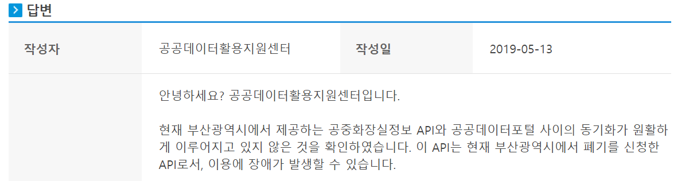
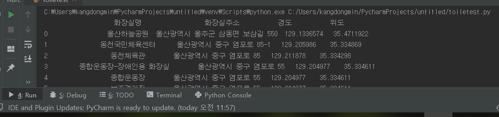

# 공중 화장실 API 활용

학과 | 학번 | 성명
---- | ---- | ---- 
정보컴퓨터공학전공 |201661701 |강동민

## 프로젝트 개요
<strong>프로젝트 계획</strong>

<strong>[공공데이터포털](https://data.go.kr)</strong>에서 OPEN API로 제공되고, 실생활에 활용가능성이 높은 공중 화장실 정보를 다루어 본다.

차후에 웹, ANDROID 및 iOS 어플리케이션, GUI 관련 툴 등을 학습하여 연계할 수 있을 것으로 생각하여 선택하였고,
실제로 공부해둔 간단한 html 및 css와 연계함.

<strong>프로젝트 최종 목표</strong>

<em>파이썬을 통해, OPEN API로 부터 몇 가지 유용한 항목을 전달받아 HTML 파일을 출력하는 코드 작성.</em>

<strong>프로젝트 진행 과정</strong>

처음에 부산광역시 공중화장실 정보를 이용하려고 하였으나, 다음과 같은 문제가 발생함.

따라서 부산광역시 공중화장실 정보와 오퍼레이션이 매우 유사한 울산광역시 공중화장실 정보를 이용함.

파이썬으로 HTML을 출력하는 파일을 코딩할 시, 다음과 같은 비경제성 발생
  
    >>> f.write('<a href="http://pusan.ac.kr/">부산대</a>') # 라고 작성해야,
    <a href="http://pusan.ac.kr/">부산대</a> # html파일에서 html 문법에 맞게 출력

즉, 쉽게 작성 할 수 있는 마크업언어인 html을 파이썬의 file.write()로 한줄씩 입력해야함.
따라서 부분적으로 [htmltag](https://github.com/LiftoffSoftware/htmltag) 라는 파이썬 모듈을 도입하여 비경제성을 미약하게나마 해결 시도함.

공중화장실 API에서 각 화장실의 위도와 경도 값을 제공하는 것을 발견하고, 구글 지도에서 위도, 경도로 검색하는 기능을 이용하여 화장실 위치를 나타내는 구글 지도 링크를 생성하도록 함. (네이버와 다음 지도 또한 각각의 API 이용하면 가능)

Open API의 XML에서 받아온 정보를, HTML 작성과 동시에 PANDAS로 활용하여 유용한 정보를 정리하여 아래와 같이 IDE 상의 console에서 출력하도록 함

<strong>프로젝트 결과</strong>

[GitHub Pages 활용 웹사이트](https://gloomydumber.github.io/pyapihtmlalhpa/result.html)
(새창으로 열기 : Ctrl + Click)

cf)[What is Github pages](https://help.github.com/en/articles/what-is-github-pages)

<strong>프로젝트 한계</strong>

javascript를 통한 Open API 반응형 웹을 구축하면, API상의 정보가 변할 때마다 python을 통한 HTML 출력 후, 서버에 업로드 해야하는 비경제적이고 불합리한 문제 해결 가능.

울산광역시 공중화장실 정보 API에서 제공하는 정보의 양이나 질이 낮고, 업데이트 빈도가 낮음.

(각기 다른 화장실임에도, 같은 시설 내에 있으면 모두 같은 위도 경도 값을 가짐.)

프로젝트의 의의를 <strong><em>python</em></strong>으로 OPEN API를 활용한 것에 두기로 한다.

## 사용한 공공데이터 
[데이터보기](http://data.ulsan.go.kr/rest/ulsantoilet/getUlsantoiletList?authApiKey=DEjz18TCYogpRgTo7XL5cAGOmLWhnd30DiWD%2BP2cqkUNMP%2F8%2FBNM4jxZ72gKpNNPG6XOAZzXcmg5kXATmq499g%3D%3D&numOfRows=9999)
(새창으로 열기 : Ctrl + Click)

## 소스
* [링크로 소스 내용 보기](https://github.com/gloomydumber/pyapihtmlalhpa/blob/master/toiletest.py) 
(새창으로 열기 : Ctrl + Click)
* 코드 삽입
~~~python
import urllib.request
import xml.etree.cElementTree as et
import pandas as pd
from htmltag import title
from htmltag import a
from htmltag import span

class GetData: # API에서 자료 불러오기
    url = "http://data.ulsan.go.kr/rest/ulsantoilet/getUlsantoiletList?authApiKey=" \
          "DEjz18TCYogpRgTo7XL5cAGOmLWhnd30DiWD%2BP2cqkUNMP%2F8%2FBNM4jxZ72gKpNNPG6XOA" \
          "ZzXcmg5kXATmq499g%3D%3D&numOfRows=9999"
    def main(self):
        data = urllib.request.urlopen(self.url).read()
        f = open("testoftoiletz.xml","wb")
        f.write(data)
        f.close()

getData = GetData()
getData.main()

def getvalueofnode(node):
    return node.text if node is not None else None

parsed_xml = et.parse("testoftoiletz.xml")
root=parsed_xml.getroot()
dfcols = ['화장실명', '화장실주소', '경도', '위도'] #pandas 작성부분
df_xml = pd.DataFrame(columns=dfcols)

fh = open("result.html", "w") #html 작성부분

def htmlwrite1():
    fh.write("<html>")
    #fh.write('<meta charset="utf-8">') # LOCAL과 SERVER에 올렸을때 글자 깨짐 차이
    fh.write('<meta name="viewport" content="width=device-width">')
    fh.write('<meta name="viewport" content="width=device-width, initial-scale=1">')
    tit = title("울산광역시 공중화장실 정보")
    fh.write(tit)
    fh.write(str('<link rel="stylesheet" href="styletoilet.css">'))  # css 도입
    fh.write(str(''))
    fh.write(str(''))
    fh.write(str('<h1><a href="index.html">GLOOMYDUMBER</a></h1>'))
    fh.write(str('
'))
    fh.write(str('<ul>'))
    fh.write(str('<li><a href="1.html">memes</a></li>'))
    fh.write(str('<li><a href="2.html">CB</a></ll>'))
    fh.write(str('<li><a href="3.html">hguitar</a></li>'))
    fh.write(str('<li><a href="result.html">울산화장실정보</a></li>'))
    fh.write(str('</ul>'))
    fh.write(str('
'))
    fh.write(str(' '))
    fh.write(span(str('화장실이름'),id="ix"))
    fh.write('\n')
    fh.write(span(str('도로명주소'),id="ix"))
    fh.write('\n')
    fh.write(span(str('개방시간'),id="ix"))
    fh.write('\n')
    fh.write(span(str(''), id="ix2")) # 해상도 반응형 그리드
    fh.write(span(str(''), id="ix2"))
    fh.write(span(str(''), id="ix2"))

def htmlwrite2():
    fh.write(str('

'))
    fh.write(str(''))
    fh.write(str('<noscript>Please enable JavaScript to view the <a href="https://disqus.com/?ref_noscript">comments powered by Disqus.</a></noscript>'))
    fh.write(str(''))
    fh.write("</html>")

htmlwrite1()

for node in root.iter(): #API에서 받은자료를 pandas작성과 동시에 html에 작성
    toiletName = node.find('toiletName')
    if toiletName != None:
        n=(span(str(getvalueofnode(toiletName))))
        fh.write(n)
        fh.write("\n")
    toiletNewAddr = node.find('toiletNewAddr')
    if toiletNewAddr != None:
        na = (span(str(getvalueofnode(toiletNewAddr))))
    toiletXpos = node.find('toiletXpos')
    if toiletXpos != None:
        x = ((str(getvalueofnode(toiletXpos))))
    toiletYpos = node.find('toiletYpos')
    if toiletYpos != None:
        y = ((str(getvalueofnode(toiletYpos))))
        lk = str("https://www.google.co.kr/maps/place/"+y+" "+x)
        c = (span(a(na, href=lk, target="_blank")))
        fh.write(c)
        fh.write("\n")
    toiletUnisexCheck = node.find('toiletUnisexCheck')
    ''' # 전부 남녀개별 화장실이므로 생략
    if toiletUnisexCheck != None:
        tus = (span(str(getvalueofnode(toiletUnisexCheck))))
        if tus=="Y":
            fh.write(span(str("남녀공용")))
            fh.write(" ")
        else:
                fh.write(span(str("남녀개별")))
                fh.write(" ")
    '''
    toiletOpenTime = node.find('toiletOpenTime')
    if toiletOpenTime != None:
        tot = (span(str(getvalueofnode(toiletOpenTime))))
        fh.write(tot)
        fh.write(" ")
    if toiletName != None :
        df_xml = df_xml.append(pd.Series([getvalueofnode(toiletName), getvalueofnode(toiletNewAddr), getvalueofnode(toiletXpos),getvalueofnode(toiletYpos)],index=dfcols),ignore_index=True)

htmlwrite2()

print(df_xml) # pandas python ide console에 출력

fh.close()
~~~
